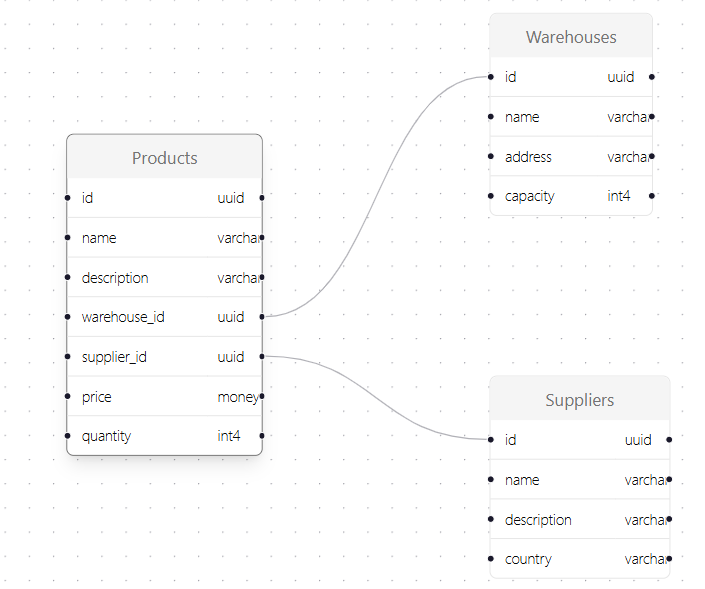

# CimDig - A Cim Inspector Application

A tool for digging deep into the CIM schema and exploring the power grid model.
This is a [Next.js](https://nextjs.org) project bootstrapped with [`create-next-app`](https://nextjs.org/docs/app/api-reference/cli/create-next-app).

## Background and Motivation

Statnett generates new component models weekly to describe the transmission grid, referred to as the "driftsentralmodell." 
These large XML files can contain errors that are often difficult to identify and correct, typically requiring manual inspection.
Currently, tools like `fgraph` (available in Devbox) and `CimDesk` are used. `fgraph` is a command-line tool for inspecting elements within the component model,
but users can easily lose track of components due to the model's size. `CimDesk` offers a graphical view of the component model but lacks visibility for specific abstract components like terminals and connectivity nodes, which, while not physically present, are part of the CIM standard.

### CimDig's Use Case

We need a tool tailored for software developers to inspect the CIM model, including abstract components like terminals and connectivity nodes. 
This will simplify the process of identifying and fixing errors in the component model.

### Our Approach for Developing CimDig

Rather than initiating a project with product owner, product sponsor etc. we opted to create a prototype.
This prototype will be developed by IT apprentices at Statnett during their one-week internship (praksisuke for IT-lærlinger).
The development will be supervised by the developers who are members of this repository.

#### Keeping Infrastructure Simple

We aim to use minimal and simple infrastructure. Initially, we will not use a database, cache server, or other infrastructure components. 
Our focus is on developing a simple prototype and providing development opportunities for the IT apprentices rather than setting up infrastructure.

#### Technical Information and Visual Look

We will use [React Flow](https://reactflow.dev/) to visualize the CIM model.
React Flow offers various visual styles, which can be explored here. One possible style is the database schema visualization:



## Getting Started

First, run the development server:

```bash
npm run dev
# or
yarn dev
# or
pnpm dev
# or
bun dev
```

Open [http://localhost:3000](http://localhost:3000) with your browser to see the result.

You can start editing the page by modifying `app/page.tsx`. The page auto-updates as you edit the file.

This project uses [`next/font`](https://nextjs.org/docs/app/building-your-application/optimizing/fonts) to automatically optimize and load [Geist](https://vercel.com/font), a new font family for Vercel.

## Learn More

To learn more about Next.js, take a look at the following resources:

- [Next.js Documentation](https://nextjs.org/docs) - learn about Next.js features and API.
- [Learn Next.js](https://nextjs.org/learn) - an interactive Next.js tutorial.

You can check out [the Next.js GitHub repository](https://github.com/vercel/next.js) - your feedback and contributions are welcome!

## Deploy on Vercel

The easiest way to deploy your Next.js app is to use the [Vercel Platform](https://vercel.com/new?utm_medium=default-template&filter=next.js&utm_source=create-next-app&utm_campaign=create-next-app-readme) from the creators of Next.js.

Check out our [Next.js deployment documentation](https://nextjs.org/docs/app/building-your-application/deploying) for more details.
